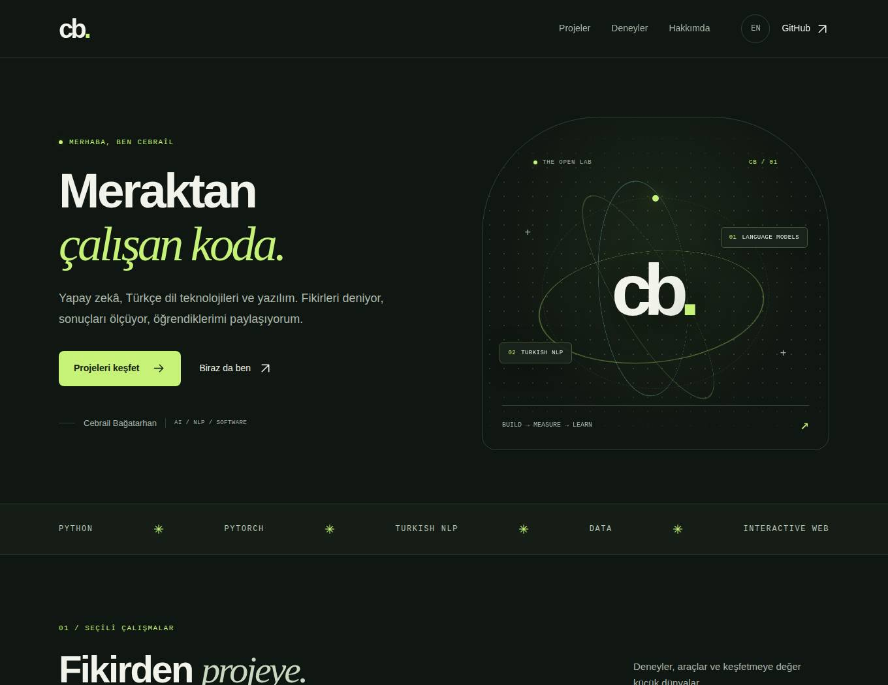
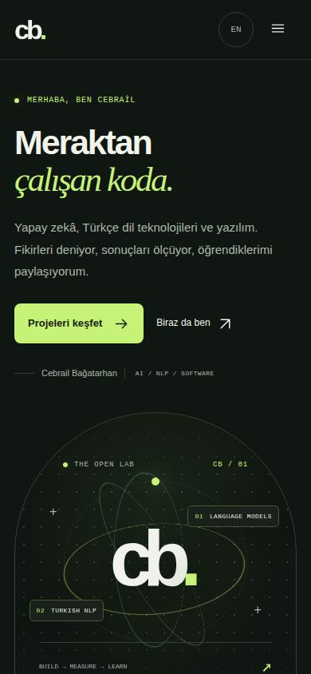
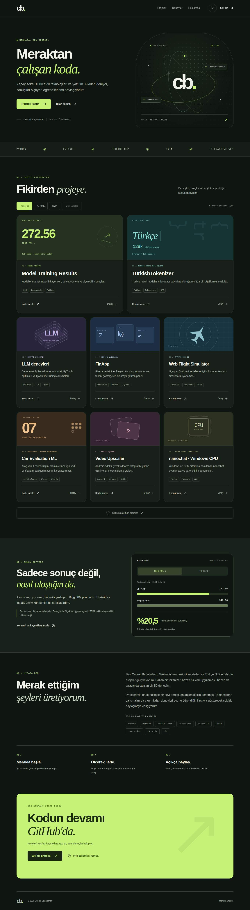

# Cebrail Bağatarhan — kişisel portföy

Site dosyaları `docs/` klasöründe. HTML, CSS ve JavaScript ile çalışır; üretim için paket kurulumu, derleme veya API anahtarı gerekmez.

- Türkçe açılış ve hatırlanan İngilizce tercihi
- Sekiz proje, kategori filtreleri ve erişilebilir proje detayı pencereleri
- Bigg 50M deneyinde PPL / token-saniye karşılaştırması
- Mobil menü, klavye desteği ve azaltılmış hareket tercihi
- JavaScript kapalıyken de erişilebilir içerik ve kaynak bağlantıları

## Tasarım önizlemesi

Mobil görünümü aç

Tüm sayfayı gör

[Site dosyalarını ZIP olarak indir](https://github.com/cebrailbagatarhan/cebrail/archive/refs/heads/codex/portfolio-site.zip)

## Tarayıcıda açmak

`docs/index.html` dosyasını tarayıcıda açabilir veya repo kökünde `python -m http.server 8000 --directory docs` çalıştırıp `http://localhost:8000` adresine gidebilirsin.

## GitHub Pages ile yayın

Bu repo için Pages henüz açık değildi. Yayın ayarını değiştirmek için bağlı GitHub aracında bir işlem bulunmuyor.

1. Portföy değişikliğini `main` dalına birleştir.
2. [Settings → Pages](https://github.com/cebrailbagatarhan/cebrail/settings/pages) bölümünü aç.
3. Source: **Deploy from a branch**, branch: **main**, folder: **/docs** seçip kaydet.

GitHub dağıtımı başarıyla tamamlandığında beklenen adres: **https://cebrailbagatarhan.github.io/cebrail/**. Bu adres, dağıtım tamamlanana kadar canlı site olarak kabul edilmemeli. Özel alan adı gerekli değildir.

[GitHub'ın resmi yayın ayarı dokümanı](https://docs.github.com/en/pages/getting-started-with-github-pages/configuring-a-publishing-source-for-your-github-pages-site)

## İçeriği düzenlemek

- `docs/index.html`: sayfa içeriği ve kartlar. Çeviriler `data-tr` / `data-en` alanlarında.
- `docs/styles.css`: renkler, düzen, mobil kırılımlar ve animasyonlar.
- `docs/app.js`: proje detayları, filtreler, dil tercihi ve gerçek deney metrikleri.
- `docs/favicon.svg`: site simgesi.

Yeni proje eklerken HTML kartını ve JavaScript içindeki `projects` kaydını birlikte güncelle. Kategori sonuç sayacı kartlardan hesaplanır. Araştırma sonuçlarının kapsam ve kaynak notlarını koru. Uçuş simülatörü ve nanochat projelerinin uyarlama olduğu belirtilmiştir.

## Doğrulama

`.github/workflows/portfolio-check.yml`, değişiklik isteklerinde Chromium ile filtreleri, dil kalıcılığını, proje penceresini, metrik geçişlerini, kopyalama işlemini, mobil menüyü ve iki dilde taşma durumunu kontrol eder. JavaScript kapalı durumu da ayrıca kontrol edilir. Ekran görüntüleri ve rapor workflow artefaktında saklanır.

Tarayıcı kontrolleri için Playwright **1.63.0** kullanılır; ziyaretçilere gönderilen sitede bağımlılık yoktur.

Son kontrol: Chromium'da 10 kontrol geçti. Türkçe ve İngilizce için 320, 390, 768 ve 1440 px genişlikler doğrulandı. Masaüstü, mobil ve tam sayfa ekran görüntüleri gerçek tarayıcı çıktılarıdır.
