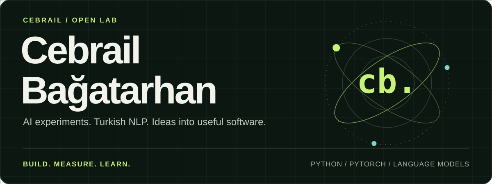
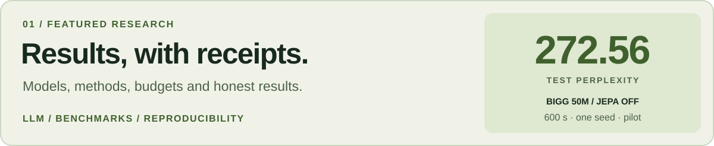
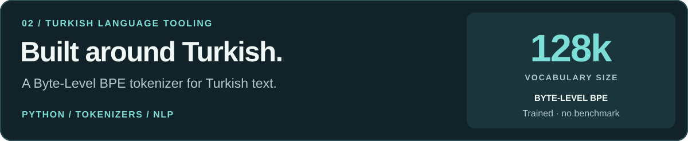

<picture>
  <source media="(max-width: 600px)" srcset="assets/profile/hero-mobile.svg" />
  
</picture>

  <a href="#selected-work"><strong>Selected work</strong></a> &nbsp; / &nbsp;
  <a href="#experiment-notes"><strong>Experiment notes</strong></a> &nbsp; / &nbsp;
  <a href="#toolbox"><strong>Toolbox</strong></a> &nbsp; / &nbsp;
  <a href="https://github.com/cebrailbagatarhan?tab=repositories"><strong>All repositories ↗</strong></a>

 

I build and explore **machine-learning systems, language models and Turkish NLP tools** — alongside practical apps and interactive web experiments.

My working principle: **learn deeply, measure honestly, ship useful things.**

## Selected work

<a href="https://github.com/cebrailbagatarhan/model-training-results">
  <picture>
    <source media="(max-width: 600px)" srcset="assets/profile/research-mobile.svg" />
    
  </picture>
</a>

**[Model Training Results ↗](https://github.com/cebrailbagatarhan/model-training-results)**  
A public notebook of LLM/ML experiments: what ran, what it cost, what improved and what remains unverified. Includes methodology, metrics and original source links.

<a href="https://github.com/cebrailbagatarhan/TurkishTokenizer">
  <picture>
    <source media="(max-width: 600px)" srcset="assets/profile/tokenizer-mobile.svg" />
    
  </picture>
</a>

**[TurkishTokenizer ↗](https://github.com/cebrailbagatarhan/TurkishTokenizer)**  
A **128,000-entry Byte-Level BPE vocabulary** trained for Turkish text. Python tooling for exploring how language becomes tokens.

### More things I've worked on

| Project | What you'll find |
| :--- | :--- |
| **[yapay-zeka-sistemi ↗](https://github.com/cebrailbagatarhan/yapay-zeka-sistemi)** | Decoder-only LLM architecture, PyTorch training experiments and Qwen fine-tuning workflows. |
| **[FinApp ↗](https://github.com/cebrailbagatarhan/FinApp)** | A Streamlit application for market data, inflation comparisons and technical signals. |
| **[car-evaluation-ml ↗](https://github.com/cebrailbagatarhan/car-evaluation-ml)** | Seven classification algorithms compared for car acceptability prediction. |
| **[web-flight-simulator ↗](https://github.com/cebrailbagatarhan/web-flight-simulator)** | An adaptation of Dimar Tarmizi's simulator, with geospatial, landing and telemetry improvements. |
| **[video-upscaler ↗](https://github.com/cebrailbagatarhan/video-upscaler)** | Android-oriented video and photo upscaling with local media processing. |
| **[nanochat-windows-cpu ↗](https://github.com/cebrailbagatarhan/nanochat-windows-cpu)** | A Windows CPU-focused nanochat adaptation and local LLM training experiments. |

## Experiment notes

**A result is more interesting when you can inspect how it happened.**

In the **Bigg 50M pilot**, JEPA-off processed more tokens and reached lower test perplexity than the legacy JEPA setup under the same **600-second budget**.

| Same budget · seed 42 | JEPA off | Legacy JEPA |
| :--- | ---: | ---: |
| Throughput · tok/s ↑ | **8,584.66** | 6,607.76 |
| Test perplexity ↓ | **272.56** | 342.90 |

That is approximately **20.5% lower test perplexity in this pilot**. This is a single-seed comparison of these implementations at this scale, not a general conclusion about JEPA.

**[Read the experiment and methodology ↗](https://github.com/cebrailbagatarhan/model-training-results/tree/main/experiments/bigg-50m-jepa-vs-off)**

<strong>Open the rest of the lab notes — completed, partial and experimental runs</strong>

 

| Experiment | Recorded result | What it establishes |
| :--- | :--- | :--- |
| **Turkish Qwen2.5-7B QLoRA** | 200-step Turkish SFT; average training loss ~0.9459. | Training completed; no held-out evaluation yet. |
| **Turkmodel 6.08B** | 400 H100 steps, ~13.1M tokens; final training loss 4.78736. | A short infrastructure proof of concept, not a finished model-quality result. |
| **ModernLLM-Large 1.129B** | Model artifacts and partial H100 pretrain/SFT/CoT attempts. | Partial runs; no clean final benchmark. |

The archive also tracks **Ouroboros-Mini, nanochat Windows CPU, Car Evaluation ML and the Turkish 128k BPE tokenizer**, with explicit completed, partial, experimental and self-reported labels.

For future Bigg comparisons, the recorded JEPA-off baseline is **test NLL 5.607873 / PPL 272.563981**.

Model/checkpoint binaries stay at their original locations. The archive keeps results, methodology and links to the original GitHub, Drive and Colab sources.

[Experiment index ↗](https://github.com/cebrailbagatarhan/model-training-results/blob/main/EXPERIMENT_INDEX.md) · [Visual results gallery ↗](https://github.com/cebrailbagatarhan/model-training-results/blob/main/MODEL_VISUALS.md)

## Toolbox

| Area | Languages & tools |
| :--- | :--- |
| **AI & language** | Python · PyTorch · scikit-learn · Tokenizers |
| **Data & applications** | Streamlit · Flask · SQLite · Plotly |
| **Web & interactive work** | JavaScript · HTML · CSS · Three.js · CesiumJS · Vite |
| **Development** | Git · GitHub · VS Code |

### Around the lab

**LLM architecture & training** · **Turkish tokenization** · **Model evaluation** · **Data applications** · **Web & 3D**

These are the threads connecting my repositories: understanding models, building language tools and turning experiments into software people can explore.

## The contribution trail

<picture>
  <source media="(prefers-color-scheme: dark)" srcset="https://raw.githubusercontent.com/cebrailbagatarhan/cebrail/output/github-contribution-grid-snake-dark.svg" />
  
</picture>

---

  <strong>Build with curiosity. Leave the evidence.</strong>
    
  <a href="https://github.com/cebrailbagatarhan?tab=repositories"><strong>Explore the repositories ↗</strong></a>
  &nbsp; · &nbsp;
  <a href="https://github.com/cebrailbagatarhan/model-training-results"><strong>Read the experiments ↗</strong></a>

